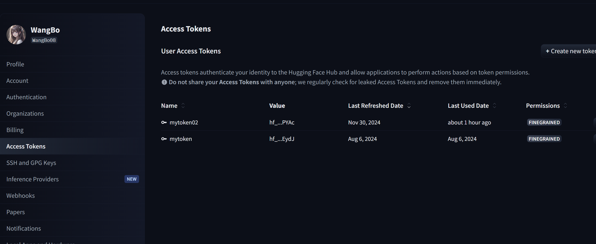

## 丢掉整合包！从此不报错！ComfyUI环境自动管理神器！一键安装ComfyUI环境、节点依赖和模型安装，真正一键启动

### 核心功能
- 一键自动安装ComfyUI环境、节点、依赖和下载模型
- 自动处理依赖冲突
- 自动管理pytorch环境（环境崩90%都是torch环境崩）
- 环境一致性和环境分享，只需要管理三个配置文件就能快速复制ComfyUI环境
- 高阶：手动锁定依赖版本
- 其他更多强大功能，后续持续更新

### 使用方法

### 参数配置
配置文件：`config.toml`
1. 配置huggingface的下载token： 部分huggingface 文件可能需要配置token才能下载（头像-Access Tokens,新建token，并且给token指定仓库)，具体请参考[huggingface](https://huggingface.co/models)

#### 一键运行
一键安装及启动:右键`setup.ps1` 使用PowerShell运行

#### 仅启动
启动ComfyUI环境：右键`start.ps1` 使用PowerShell运行

#### 安装节点
将节点地址维护到`repos.toml`中，然后运行`setup.ps1`

#### 安装模型
将模型地址维护到`models.toml`中，然后运行`setup.ps1`

#### 安装hugging face仓库-主要针对LLM模型
将仓库地址维护到`repos_hf.toml`中，然后运行`setup.ps1`

#### 更新依赖
右键`install_requirements.ps1` 使用PowerShell运行

#### 初始化基础环境-修复pytorch环境
右键`init_pytorch.ps1` 使用PowerShell运行